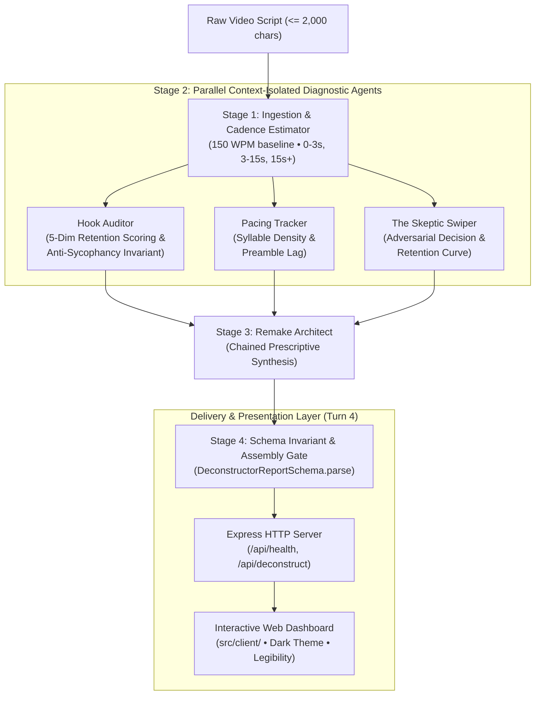

# LLMProj-ViralVideo: Viral Hook & Retention Deconstructor

> **Adversarial Multi-Agent Attention Engine &bull; Zero Sycophancy &bull; Merge-Readiness Pack**  
> *Course Project for Agentic AI Software Engineering (Modules 6–16)*

[](#verification-evidence)
[](#technology-stack)
[](#verification-evidence)
[](#zero-leakage-security-policy)
[](LICENSE)

---

## 1. Project Overview & Problem Statement

### 1.1 The Cognitive Reality: The Swipe Zone (0.0–3.0s)
In short-form vertical algorithmic video ecosystems (TikTok, Instagram Reels, YouTube Shorts), viewer retention is dictated by an involuntary sub-second cognitive gating mechanism. Within **0 to 3 seconds** ("The Swipe Zone"), viewers evaluate cognitive friction versus anticipated value payoff. 

Scripts fail not from poor aggregate content, but from opening friction:
- **Preamble Fatigue**: Greetings and channel throat-clearing (*"Hey guys, welcome back..."*).
- **Abstract Vagueness**: Concepts devoid of tangible sensory anchors (*"Let's talk about success..."*).
- **Absence of Open Loops**: Immediate disclosure of conclusions without curiosity deficits.

### 1.2 The Failure of Generic LLMs: Systematic Sycophancy
Off-the-shelf foundation models fine-tuned with RLHF exhibit severe **Sycophancy Bias**. When creators submit draft scripts, generic models provide polite, flattering affirmations (*"This is a great energetic opening!"*), blinding creators to fatal retention drop-offs.

### 1.3 The Engineering Solution
**LLMProj-ViralVideo** is an adversarial multi-agent pipeline designed to deconstruct short-form video scripts without flattery:
1. Partitions scripts into deterministic temporal windows based on a **150 WPM (2.5 words/sec)** cadence.
2. Isolates the opening 3-second Swipe Zone and runs parallel diagnostic agents.
3. Enforces a mathematical **Anti-Sycophancy Invariant** ($\ge 2$ concrete failure points).
4. Simulates an impatient viewer (**The Skeptic Swiper**) to project abandonment timestamps.
5. Prescribes 3 viral archetype rewrites ($\le 8$ words each) engineered to survive second 3.0.

---

## 2. Multi-Agent System Architecture



### Text Architecture Overview
```text
+---------------------------------------------------------------------------------------+
| Ingestion & Cadence Estimator (src/services/cadenceEstimator.ts)                      |
| - Pure-code 150 WPM baseline (2.5 wps) &bull; Slices: Swipe (0-3s), Value (3-15s), Body (15s+) |
+---------------------------------------------------------------------------------------+
                                           |
                 +-------------------------+-------------------------+
                 |                         |                         |
                 v                         v                         v
+-----------------------------+  +-------------------+  +-------------------------------+
| Hook Auditor                |  | Pacing Tracker    |  | Skeptic Swiper                |
| - 5-Dim Retention Scores    |  | - Syllable Density|  | - Adversarial swipe timestamp |
| - >= 2 Negative Critiques   |  | - Preamble Lag ms |  | - Predicted 3s retention score|
+-----------------------------+  +-------------------+  +-------------------------------+
                 |                         |                         |
                 +-------------------------+-------------------------+
                                           |
                                           v
+---------------------------------------------------------------------------------------+
| Remake Architect (src/services/agents/remakeArchitect.ts)                             |
| - Chained synthesis &bull; Generates 3 Viral Archetype Rewrites (<= 8 words, <= 4s)          |
+---------------------------------------------------------------------------------------+
                                           |
                                           v
+---------------------------------------------------------------------------------------+
| Output Validator Gate (Zod Schema parse &bull; Anti-Sycophancy Invariant Guarantee)      |
+---------------------------------------------------------------------------------------+
                                           |
                                           v
+---------------------------------------------------------------------------------------+
| Delivery Layer: Express HTTP API (src/app.ts) & Responsive Dashboard (src/client/)    |
+---------------------------------------------------------------------------------------+
```

---

## 3. Course Curriculum Compliance Matrix

This repository serves as a rigorous reference implementation mapping directly to the course modules:

| Module / Topic | Requirement / Specification | Implementation File(s) | Verification Suite |
|---|---|---|---|
| **Module 6: Context Engineering** | Zero-cost Golden Dataset, negative prompt anchors, boundary fixtures | [`tests/fixtures/scripts.ts`](file:///c:/Users/Amit/Desktop/Github/LLMProj-ViralVideo/tests/fixtures/scripts.ts), [`docs/framing.md`](file:///c:/Users/Amit/Desktop/Github/LLMProj-ViralVideo/docs/framing.md) | Unit tests in `cadenceEstimator.test.ts` |
| **Module 7: Delivery Mechanics** | REST API endpoints (`/api/health`, `/api/deconstruct`), middleware, error handling | [`src/app.ts`](file:///c:/Users/Amit/Desktop/Github/LLMProj-ViralVideo/src/app.ts), [`src/server.ts`](file:///c:/Users/Amit/Desktop/Github/LLMProj-ViralVideo/src/server.ts) | [`tests/integration/apiRoute.test.ts`](file:///c:/Users/Amit/Desktop/Github/LLMProj-ViralVideo/tests/integration/apiRoute.test.ts) (8 tests) |
| **Module 8: Legibility & UI** | Dark-theme dashboard, ergonomic layout, visual Swipe Zone, live counters | [`src/client/index.html`](file:///c:/Users/Amit/Desktop/Github/LLMProj-ViralVideo/src/client/index.html), [`src/client/css/styles.css`](file:///c:/Users/Amit/Desktop/Github/LLMProj-ViralVideo/src/client/css/styles.css), [`src/client/js/app.js`](file:///c:/Users/Amit/Desktop/Github/LLMProj-ViralVideo/src/client/js/app.js) | Static delivery integration tests |
| **Module 10: Adversarial Simulation** | The Skeptic Swiper agent, feed drop-off calibration, brutal verdict | [`src/services/agents/skepticSwiper.ts`](file:///c:/Users/Amit/Desktop/Github/LLMProj-ViralVideo/src/services/agents/skepticSwiper.ts) | [`tests/unit/orchestrator.test.ts`](file:///c:/Users/Amit/Desktop/Github/LLMProj-ViralVideo/tests/unit/orchestrator.test.ts) (SC-3) |
| **Module 11: Prescriptive Remake** | Tri-Archetype synthesis (`negative_frame`, `high_stakes_intrigue`, `visceral_pattern_interrupt`) | [`src/services/agents/remakeArchitect.ts`](file:///c:/Users/Amit/Desktop/Github/LLMProj-ViralVideo/src/services/agents/remakeArchitect.ts) | [`tests/unit/coordination.test.ts`](file:///c:/Users/Amit/Desktop/Github/LLMProj-ViralVideo/tests/unit/coordination.test.ts) (SC-4) |
| **Module 13: Verification Before Trust** | Independent testing, TDD Red-to-Green, pre-commit gates, zero verification theater | [`scripts/check-secrets.mjs`](file:///c:/Users/Amit/Desktop/Github/LLMProj-ViralVideo/scripts/check-secrets.mjs), [`.husky/pre-commit`](file:///c:/Users/Amit/Desktop/Github/LLMProj-ViralVideo/.husky/pre-commit) | `npm run verify` (ESLint + tsc + Vitest) |
| **Module 14: Data Contracts & Types** | Strict TypeScript interfaces, Zod runtime schemas, `ValidationError` | [`src/types/script.ts`](file:///c:/Users/Amit/Desktop/Github/LLMProj-ViralVideo/src/types/script.ts), [`src/types/agents.ts`](file:///c:/Users/Amit/Desktop/Github/LLMProj-ViralVideo/src/types/agents.ts), [`src/validators/scriptValidator.ts`](file:///c:/Users/Amit/Desktop/Github/LLMProj-ViralVideo/src/validators/scriptValidator.ts) | [`tests/unit/scriptValidator.test.ts`](file:///c:/Users/Amit/Desktop/Github/LLMProj-ViralVideo/tests/unit/scriptValidator.test.ts) |
| **Module 15: Deterministic Algorithms** | 150 WPM cadence estimator, 3 temporal windows, multi-agent orchestration | [`src/services/cadenceEstimator.ts`](file:///c:/Users/Amit/Desktop/Github/LLMProj-ViralVideo/src/services/cadenceEstimator.ts), [`src/services/deconstructorOrchestrator.ts`](file:///c:/Users/Amit/Desktop/Github/LLMProj-ViralVideo/src/services/deconstructorOrchestrator.ts) | [`tests/unit/cadenceEstimator.test.ts`](file:///c:/Users/Amit/Desktop/Github/LLMProj-ViralVideo/tests/unit/cadenceEstimator.test.ts) |
| **Module 16: Merge-Readiness Pack** | Multi-agent coordination trail, conventional atomic commits, release gate | [`docs/coordination.md`](file:///c:/Users/Amit/Desktop/Github/LLMProj-ViralVideo/docs/coordination.md), [`README.md`](file:///c:/Users/Amit/Desktop/Github/LLMProj-ViralVideo/README.md) | Git log & commit history |

---

## 4. Verification Evidence & Quality Gates

The project enforces an uncompromising quality gate chain executed before every commit:

```bash
npm run verify  # Runs: npm run lint && npm run build && npm run test
```

### 4.1 Test Inventory (56/56 Tests Passing - 100%)
```text
 ✓ tests/index.test.ts (1 test)
 ✓ tests/unit/scriptValidator.test.ts (11 tests)
 ✓ tests/unit/coordination.test.ts (12 tests)
 ✓ tests/unit/cadenceEstimator.test.ts (13 tests)
 ✓ tests/unit/orchestrator.test.ts (11 tests)
 ✓ tests/integration/apiRoute.test.ts (8 tests)

Test Files  6 passed (6)
     Tests  56 passed (56)
```

### 4.2 Core Quality Guarantees
1. **Zero Token Burn with Deterministic Mock Driver**:
   - Automated tests run 100% offline via [`MockLlmDriver`](file:///c:/Users/Amit/Desktop/Github/LLMProj-ViralVideo/src/drivers/llmDriver.ts#L86), calibrated against the Golden Dataset. Zero external API keys or network latency required for CI/CD.
2. **Strict Anti-Sycophancy Invariant (SC-2.1)**:
   - Zod runtime schema rejects any evaluation payload containing fewer than 2 negative critique points with:  
     `"Anti-Sycophancy Invariant Violated: Must identify at least 2 negative failure points in the hook"`.
3. **Strict Input Boundary Protection (SC-1.1)**:
   - Scripts exceeding 2,000 characters, empty strings, or whitespace-only inputs are rejected with an explicit `ValidationError` (HTTP 400).
4. **Zero-Leakage Security Policy**:
   - `scripts/check-secrets.mjs` scans all tracked files for OpenAI, Anthropic, Gemini, AWS, GitHub, and private keys. 0 credentials committed.

---

## 5. Quick Start Guide

### 5.1 Prerequisites
- **Node.js**: `>= 20.0.0` (LTS recommended)
- **Package Manager**: `npm`

### 5.2 Installation & Verification
Clone the repository and install dependencies:
```bash
git clone https://github.com/Amityst12/LLMProj-ViralVideo.git
cd LLMProj-ViralVideo
npm install
```

Run the complete verification gate:
```bash
npm run verify
```

### 5.3 Running the Local Web Server & Dashboard
Start the Express delivery layer:
```bash
npm run dev
# Or: npm start
```

Open your browser and navigate to:
```text
http://localhost:3000
```

- Click **"🔥 Load Viral Script"** to inspect a high-retention hook that survives the 3.0-second Swipe Zone.
- Click **"😴 Load Mediocre Script"** to observe how greeting throat-clearing triggers an immediate drop-off verdict (`swipeAtSecond: 1`) by The Skeptic Swiper.

### 5.4 Live Cloud Inference (Optional)
To run with live models (Claude 3.5 Sonnet, GPT-4o, Gemini 1.5 Pro) via OpenRouter:
1. Copy `.env.example` to `.env`:
   ```bash
   cp .env.example .env
   ```
2. Set your OpenRouter API key:
   ```env
   OPENROUTER_API_KEY=sk-or-v1-your-key-here
   OPENROUTER_MODEL=anthropic/claude-3.5-sonnet
   ```
3. Restart the server. The dashboard will automatically transition from `⚡ Simulation Mode` to `🟢 Live Cloud Mode`.

---

## 6. Multi-Agent Development Trail

This project was built and audited following bounded multi-agent collaboration turns:
- **Ada (Senior QA & Test Engineer)**: Derived objective acceptance criteria directly from `docs/spec.md`, authored the Golden Dataset fixtures, and wrote all 56 tests across 6 suites in TDD Red Phase.
- **Alan (Senior Backend & Core Systems Engineer)**: Implemented TypeScript contracts, Zod validators, the deterministic 150 WPM Cadence Estimator, parallel diagnostic agents, the Express delivery layer, and the dark-theme dashboard in TDD Green Phase.
- **Grace (Security, Quality & Merge-Readiness Gatekeeper)**: Audited test integrity against verification theater, enforced the Anti-Sycophancy Invariant, executed pre-commit security scans, compiled the audit reports in `docs/coordination.md`, and performed atomic conventional commits.

For full turn-by-turn logs, consult [`docs/coordination.md`](file:///c:/Users/Amit/Desktop/Github/LLMProj-ViralVideo/docs/coordination.md).
