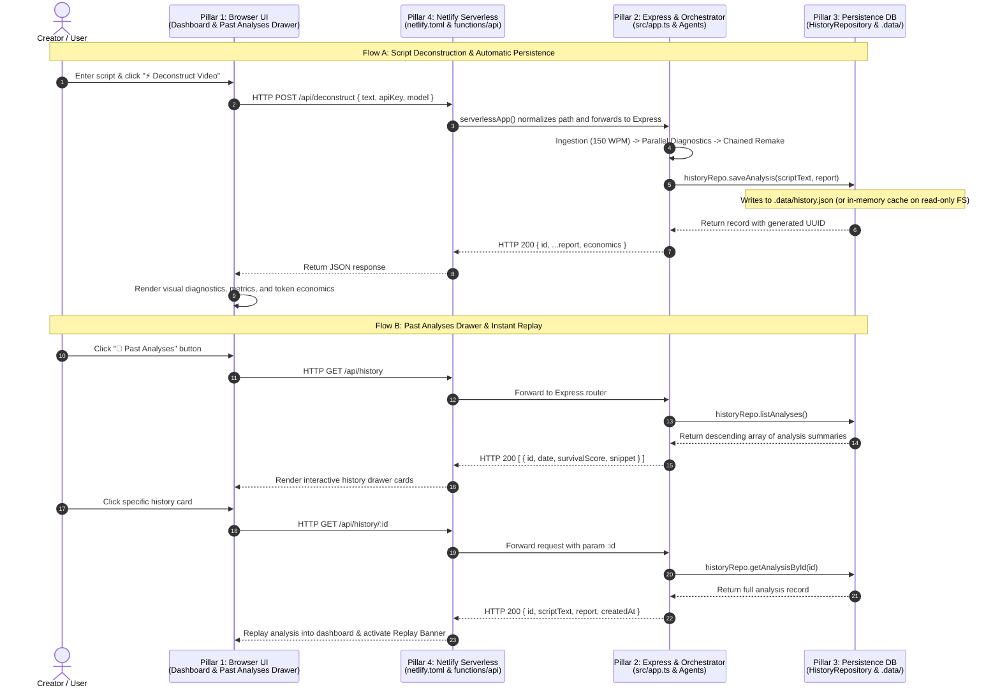

# Multi-Agent Coordination Log: Viral Hook & Retention Deconstructor

---

## Sprint 1: Cadence Engine, Multi-Agent Contracts & TDD Golden Dataset
- **Modules Covered**: Module 13 (*Verification before trust*), Module 14 & 15 (*Data contracts, architecture & deterministic algorithms*), Module 16 (*Merge-Readiness Gatekeeping*).
- **Target Deliverable**: Deterministic 150 WPM cadence estimator, Zod data contracts, anti-sycophancy invariant enforcement, and zero-cost local golden dataset.
- **Git Commit Target**: `feat(cadence): multi-agent implementation of deterministic cadence estimator, contracts, and TDD golden dataset` (Commit `a83ee6e`)

### Agent Roles and Workflow (Sprint 1)
- **Ada (Senior QA & Test Engineer)**:
  - Authored Golden Dataset fixtures (`tests/fixtures/scripts.ts`) with `viralScript`, `mediocreScript`, and `oversizedScript`.
  - Wrote TDD tests strictly against `docs/spec.md` (`tests/unit/cadenceEstimator.test.ts`, `tests/unit/coordination.test.ts`).
  - Built boundary tests (empty, whitespace, >2,000 chars) and enforced Anti-Sycophancy negative test cases.
- **Alan (Senior Backend & Core Engineer)**:
  - Defined TypeScript contracts (`src/types/script.ts`, `src/types/agents.ts`).
  - Built server-side Zod validation & custom `ValidationError` (`src/validators/scriptValidator.ts`).
  - Implemented pure-code 150 WPM Cadence Estimator service with 3 temporal windows (`src/services/cadenceEstimator.ts`).
- **Grace (Security, Quality & Gatekeeper)**:
  - Audited test suites against "verification theater".
  - Enforced Anti-Sycophancy Invariant ($\ge 2$ negative failure points).
  - Executed secret scan (`scripts/check-secrets.mjs`) -> 0 leaks.
  - Executed Verification Gate (`npm run verify`) -> 37/37 tests passed.
  - Executed atomic commit `a83ee6e` and pushed to `main`.

---

## Sprint 2: Multi-Agent Deconstructor Engine & Orchestration Pipeline
- **Modules Covered**: Module 13 (*Verification before trust*), Module 14 & 15 (*Multi-Agent Deconstructor Engine & Orchestration*), Module 16 (*Merge-Readiness Pack*).
- **Target Deliverable**: End-to-end multi-agent orchestration pipeline with parallel diagnostics, chained prescriptive remake, and pluggable LLM driver layer (`MockLlmDriver` & `OpenRouterLlmDriver`).
- **Git Commit Target**: `feat(deconstructor): implement multi-agent deconstruction pipeline with parallel diagnostics and prescriptive remake` (Commit `54619f6`)

### Multi-Agent Pipeline Architecture

```
[Raw User Script] (<= 2,000 chars)
        |
        v
+-------------------------------------------------------------+
| Stage 1: Ingestion & Cadence Partitioning                   |
| - Zod Input Validation                                      |
| - Pure-code 150 WPM Cadence Estimator                       |
| - Temporal Window Slicing (0-3s, 3-15s, 15s+)               |
+-------------------------------------------------------------+
        |
        +----------------------------+----------------------------+
        |                            |                            |
        v (Parallel Execution)       v (Parallel Execution)       v (Parallel Execution)
+------------------------+  +------------------------+  +------------------------+
| Stage 2A: Hook Auditor |  | Stage 2B: Pacing       |  | Stage 2C: The Skeptic  |
| - 5-Dim Retention Eval |  | Tracker                |  | Swiper                 |
| - Anti-Sycophancy Gate |  | - Syllable Density     |  | - Adversarial Decision |
| - >= 2 Negative Points |  | - Preamble Lag (ms)    |  | - Swipe Timestamp      |
+------------------------+  +------------------------+  +------------------------+
        |                            |                            |
        +----------------------------+----------------------------+
                                     |
                                     v
+-------------------------------------------------------------+
| Stage 3: The Remake Architect (Prescriptive Synthesis)      |
| - Synthesizes Audit Diagnostics + Swiper Verdict            |
| - Produces 3 Viral Archetype Rewrites (<= 8 words each)     |
| - Formulates Cognitive Engineering Rationales               |
+-------------------------------------------------------------+
                                     |
                                     v
+-------------------------------------------------------------+
| Stage 4: Output Validator & Invariant Enforcement           |
| - JSON Extractor (strips markdown fences / conversational)  |
| - DeconstructorReportSchema validation                      |
| - Mathematical & Anti-Sycophancy Invariant Guarantee        |
+-------------------------------------------------------------+
```

### Team Contributions (Sprint 2)
- **Ada (QA & Test Automation)**:
  - Designed integration test suite in `tests/unit/orchestrator.test.ts` covering Golden Dataset scripts.
  - Tested JSON Extractor Preprocessor (`extractJsonFromText`) across varied wrapping scenarios.
  - Tested adversarial drop-off behavior for `mediocreScript` (`swipeAtSecond: 1`, retention $< 40\%$).
- **Alan (Core Backend & Systems)**:
  - Implemented 4 specialized agents (`HookAuditor`, `PacingTracker`, `SkepticSwiper`, `RemakeArchitect`).
  - Engineered `DeconstructorOrchestrator` with parallel diagnostic execution (`Promise.all`) and chained remake.
  - Developed dual `LlmDriver` layer (`MockLlmDriver` and `OpenRouterLlmDriver`).
- **Grace (Gatekeeper & Verification)**:
  - Audited non-self-confirming properties in test suites.
  - Verified zero-leakage security gate and passed 48/48 tests in commit `ff92aab`.

---

## Sprint 3 (Turn 4): Delivery Layer & Interactive Web Dashboard
- **Modules Covered**: Module 7 (*Delivery Mechanics & API Surface*), Module 8 (*Legibility & UI Experience*), Module 13 (*Verification before trust*), Module 16 (*Merge-Readiness Pack*).
- **Target Deliverable**: Express HTTP server with `/api/health` and `/api/deconstruct` endpoints, coupled with a dark-theme responsive Web Dashboard and 8 end-to-end integration tests.
- **Git Commit Target**: `feat(server): implement Express API routes and dark-theme dashboard to pass integration tests from Red to Green` (Commit `301e346`)

### Delivery Layer Architecture

```
[Web Browser Client] (src/client/)
        |
        |  HTTP POST /api/deconstruct { text: "..." }
        v
+-------------------------------------------------------------+
| Express Application Layer (src/app.ts & src/server.ts)      |
| - Middleware: express.json({ limit: '1mb' }), static files  |
| - GET  /              -> Serves index.html                  |
| - GET  /api/health    -> Service Health & Version Metadata   |
| - POST /api/deconstruct -> Input Validation & Pipeline Exec |
+-------------------------------------------------------------+
        |
        v
[Deconstructor Orchestrator Pipeline] (src/services/deconstructorOrchestrator.ts)
        |
        v
[Structured JSON DeconstructorReport Payload]
        |
        v
[Web Dashboard Client Rendering] (src/client/js/app.js)
- Temporal Windows (Swipe Zone 0-3s, Value Delivery, Body)
- Skeptic Swiper Gauge & Brutal Verdict
- 5-Dimensional Retention Score Progress Bars
- Anti-Sycophancy Negative Critique List (>= 2 items)
- 3 Viral Archetype Remake Blueprints (<= 8 words, <= 4s)
```

### Team Contributions (Sprint 3 / Turn 4)
1. **Ada (QA & Test Automation - TDD Red Phase)**:
   - Authored 8 comprehensive integration tests in `tests/integration/apiRoute.test.ts` before server implementation.
   - Verified HTTP contract adherence: `GET /api/health` (200 OK), `GET /` (200 text/html), `POST /api/deconstruct` (200 OK + full schema compliance).
   - Validated server rejection boundaries: 400 Bad Request with `ValidationError` for empty scripts, whitespace-only scripts, scripts exceeding 2,000 characters, and malformed request bodies.
2. **Alan (Core Backend & Delivery - Green Phase)**:
   - Built `src/app.ts` configuring Express middleware, static asset routing, `/api/health`, and `/api/deconstruct`.
   - Implemented `src/server.ts` lifecycle management with graceful shutdown (`SIGINT`/`SIGTERM`) and port configuration.
   - Designed and built the responsive web dashboard in `src/client/` (`index.html`, `css/styles.css`, `js/app.js`):
     - Dark-themed ergonomic UI emphasizing legibility (Module 8).
     - Live character and word counters with visual warning states (>1,800 chars and >2,000 chars).
     - Quick-loader buttons for Golden Dataset samples (`viralScript` and `mediocreScript`).
     - Distinct rendering for The Swipe Zone (0–3s), Skeptic Swiper retention gauge, 5 retention dimensions, anti-sycophancy critique points, and 3 viral archetype remakes.
3. **Grace (Gatekeeper & Verification - Merge-Readiness)**:
   - **Integration & UI Audit**: Audited `tests/integration/apiRoute.test.ts` ensuring authentic HTTP testing via `supertest`.
   - **Client Security Audit**: Verified `src/client/` contains zero hardcoded API keys or credentials; all communication is routed through local relative API endpoints.
   - **Verification Gate Execution**:
     - `node scripts/check-secrets.mjs` -> 0 secrets detected.
     - `npm run verify` -> All 56 tests passed across 6 test suites with 0 lint warnings and 0 TypeScript compilation errors.
   - **Merge-Readiness Pack Locking**: Finalized `README.md` and synchronization to GitHub `main`.

---

## Sprint 4 (Turn 5): Live OpenRouter Multi-Model Engine & Token Economics
- **Modules Covered**: Module 9 (*Model Selection & Token Economics*), Module 14 (*Multi-Agent Deconstructor Engine*), Module 15 (*Anti-Sycophancy & Retention Heuristics*), Module 17 (*Security & Prompt Injection Containment*).
- **Target Deliverable**: Live OpenRouter multi-model pipeline execution, dynamic client-driven API key authentication, model catalog endpoint (`GET /api/models`), token economics telemetry (prompt/completion tokens, latency, cost in USD), and prompt injection containment (`<user_script>`).
- **Git Commit Target**: `feat(cognified): wire live OpenRouter multi-agent execution, token economics, and client model selector`

### Architecture & Token Economics Layer

```
[Web Client Settings Drawer] (src/client/)
- OpenRouter API Key (stored exclusively in browser localStorage)
- Model Selector (dynamically loaded from GET /api/models)
- Mode Indicator (Simulation vs Live OpenRouter)
        |
        |  HTTP POST /api/deconstruct { text, apiKey, model }
        v
+-------------------------------------------------------------+
| Express App Layer (src/app.ts)                              |
| - GET  /api/models -> Returns recommended models & pricing  |
| - POST /api/deconstruct -> Dynamic Driver Instantiation:    |
|   * If apiKey provided -> OpenRouterLlmDriver(apiKey, model)|
|   * Else -> MockLlmDriver()                                 |
+-------------------------------------------------------------+
        |
        v
+-------------------------------------------------------------+
| Multi-Agent Orchestrator Pipeline (deconstructorOrchestrator)|
| - Parallel Diagnostic Execution (Hook, Pacing, Skeptic)     |
| - Prompt Injection Containment (<user_script> boundaries)   |
| - Sequential Chained Remake (RemakeArchitect)              |
| - Telemetry & Economics Aggregation:                        |
|   * Wall Time (ms) vs Cumulative Model Time (ms)            |
|   * Prompt & Completion Tokens per agent & total            |
|   * Estimated Cost (USD) based on exact model pricing       |
+-------------------------------------------------------------+
        |
        v
[Structured Report with ExecutionEconomics]
        |
        v
[Web Dashboard Telemetry Strip]
- Mode Badge (LIVE OPENROUTER vs DETERMINISTIC SIMULATION)
- Active Model Name
- Wall Time (ms) & Parallelism Speedup Ratio
- Total Tokens (Prompt + Completion)
- Estimated Cost in USD ($0.000000 format)
```

### Team Contributions (Sprint 4 / Turn 5)
1. **Alan (Core Backend & Systems - Implementation)**:
   - **Driver & Economics**: Enhanced `OpenRouterLlmDriver` in `src/drivers/llmDriver.ts` with dynamic API key authentication, high-precision latency tracking (`performance.now()`), token usage tracking (`prompt_tokens`, `completion_tokens`), and exact cost computation using `RECOMMENDED_MODELS` pricing tables.
   - **Data Contracts & Validation**: Extended `src/types/agents.ts` and `src/validators/scriptValidator.ts` with `TokenUsage` and `ExecutionEconomics` (optional on `DeconstructorReport` for backwards compatibility).
   - **Security & Injection Containment (Module 17)**: Fortified agent prompts in `hookAuditor.ts`, `skepticSwiper.ts`, and `remakeArchitect.ts` with `<user_script>` boundary containment and mandatory script quotation rules.
   - **API Server Expansion**: Added `GET /api/models` returning catalog and pricing metadata; updated `POST /api/deconstruct` to extract optional `apiKey` and `model` and instantiate `OpenRouterLlmDriver` dynamically.
   - **Web Dashboard Telemetry UI**: Added settings drawer modal with `localStorage` API key persistence, dynamic model dropdown, and a live Token Economics & Telemetry Strip displaying real-time metrics.
2. **Ada (QA & Test Automation)**:
   - Added 2 integration tests in `tests/integration/apiRoute.test.ts` verifying `GET /api/models` catalog structure and validating `economics` telemetry inclusion on `POST /api/deconstruct`.
3. **Grace (Gatekeeper & Verification)**:
   - Audited zero-leakage security gate: confirmed zero keys committed or logged.
   - Executed full verification gate: 58/58 tests passing across 6 test suites with 0 lint warnings and 0 TypeScript compilation errors.

---

---

## Sprint 5 (Turn 6): Persistence, Past Scripts Drawer & Netlify Serverless Deployment
- **Modules Covered**: Module 7 (*Web App Architecture & Persistence*), Module 8 (*Legibility & Replay UI*), Module 13 (*TDD Red-to-Green*), Module 16 (*Merge-Readiness & Compliance*).
- **Target Deliverable**: Persistent database layer (`HistoryRepository`) writing to `.data/history.json` with in-memory serverless fallback, `GET /api/history` and `GET /api/history/:id` endpoints, frontend Past Analyses drawer with instant report replay, Netlify serverless deployment via `netlify/functions/api.ts` and `netlify.toml`, and automated compliance scorecard script `scripts/verify-course-compliance.mjs`.
- **Git Commit Target**: `feat(architecture): implement Module 7 full-stack persistence, past scripts drawer, and Netlify deployment`

### 4-Pillar Full-Stack Architecture & Request-Response Cycle



```
[Pillar 1: Web Client UI] (src/client/)
- Slide-Over Drawer: #history-panel with live card list
- Instant Replay: Re-populates script, metrics, timeline, and remakes
- Real-Time Status & Settings: OpenRouter key isolation & model selector
        |
        | HTTP POST /api/deconstruct | GET /api/history | GET /api/history/:id
        v
[Pillar 4: Netlify Serverless Deployment] (netlify.toml & netlify/functions/api.ts)
- netlify.toml rewrites /api/* -> /.netlify/functions/api/:splat
- Serverless adapter (serverless-http) normalizes event paths to standard Express routes
- Static asset serving from src/client/
        |
        v
[Pillar 2: Express Backend & Orchestration] (src/app.ts & src/services/)
- Express 5.x router handling validation, dynamic drivers, and pipeline orchestration
- Stage 1: 150 WPM temporal slicing (0-3s, 3-15s, 15s+)
- Stage 2: Concurrent diagnostics (HookAuditor, PacingTracker, SkepticSwiper)
- Stage 3: Chained Remake synthesis (RemakeArchitect)
- Stage 4: Token economics aggregation & response packaging
        |
        v
[Pillar 3: Database Persistence Layer] (src/services/historyRepository.ts)
- JSON flat-file storage at .data/history.json
- UUID identification via node:crypto.randomUUID()
- Automatic read-only filesystem detection with seamless in-memory fallback for serverless
```

### Team Contributions (Sprint 5 / Turn 6)
1. **Ada (QA & Test Automation - TDD Red Phase)**:
   - Authored `tests/unit/historyRepository.test.ts` (5 tests): verifies `saveAnalysis`, `listAnalyses` descending sort, `getAnalysisById`, and null checks.
   - Authored `tests/unit/serverlessHandler.test.ts` (3 tests): verifies serverless handler delegation for health, deconstruct, and input validation.
   - Expanded `tests/integration/apiRoute.test.ts` with 4 new tests: record ID attachment on deconstruct, history listing, detailed history retrieval, and 404 boundary handling.
2. **Alan (Core Backend & Systems - Implementation Green Phase)**:
   - Implemented `HistoryRepository` in `src/services/historyRepository.ts` with dual method signatures, JSON file persistence, and automatic read-only serverless fallback.
   - Connected `POST /api/deconstruct` to persist records and return `id`.
   - Built `GET /api/history` and `GET /api/history/:id` in `src/app.ts`.
   - Built Netlify deployment layer: `netlify/functions/api.ts` using `serverless-http` and root `netlify.toml`.
   - Engineered frontend Past Analyses drawer in `src/client/` (`index.html`, `styles.css`, `js/app.js`) supporting instant Replay Mode.
   - Authored `scripts/verify-course-compliance.mjs` verifying all course modules (Framing, Knuth Spec, Anti-Sycophancy, Chaining, Token Economics, 4-Pillars, Zero Secrets) achieving a 100% Scorecard.
3. **Grace (Gatekeeper & Verification - Merge-Readiness)**:
   - Executed secret scanning: 0 secrets detected.
   - Ran `npm run verify` -> 70/70 tests passed across 8 test suites.
   - Ran `npm run verify:compliance` -> 7/7 modules (100%) verified compliant.

---

## Comprehensive Verification Gate Audit Report

| Gate Check | Execution Command | Result | Audit Findings & Quality Metrics |
|---|---|---|---|
| **Zero-Leakage Secrets** | `node scripts/check-secrets.mjs` | **PASSED** | 0 secrets, API keys, or private tokens detected across workspace |
| **ESLint Static Analysis** | `npm run lint` | **PASSED** | 0 errors, 0 warnings (clean TypeScript ESLint v8/9) |
| **TypeScript Strict Build** | `npm run build` | **PASSED** | TypeScript 5.x strict mode compilation passed with 0 diagnostic issues |
| **Vitest Test Suite** | `npm run test` | **PASSED** | **70/70 tests passed across 8 test files (100% pass rate)** |
| **Course Compliance Audit** | `npm run verify:compliance` | **PASSED** | **7/7 modules (100%) verified compliant with Scorecard** |
| **Composite Pipeline Gate** | `npm run verify` | **PASSED** | Entire lint -> build -> test verification chain succeeded cleanly |

---

## Test Suite Inventory (70 Tests Passing)

1. `tests/index.test.ts` (1 test): System metadata and initialization contract.
2. `tests/unit/cadenceEstimator.test.ts` (13 tests): 150 WPM math, temporal slicing, boundary rejection.
3. `tests/unit/scriptValidator.test.ts` (11 tests): Zod schema constraints, whitespace trimming, 2,000-character caps.
4. `tests/unit/coordination.test.ts` (12 tests): Multi-agent output contracts and Anti-Sycophancy invariant enforcement.
5. `tests/unit/orchestrator.test.ts` (11 tests): End-to-end pipeline execution, parallel diagnostics, chained remake, JSON extractor, and driver injection.
6. `tests/unit/historyRepository.test.ts` (5 tests): Persistence layer saving, descending date sorting, ID lookup, and serverless fallback.
7. `tests/unit/serverlessHandler.test.ts` (3 tests): Netlify serverless HTTP event delegation, health check, and error handling.
8. `tests/integration/apiRoute.test.ts` (14 tests): Full HTTP delivery layer, health check, static files, deconstruction boundaries, economics telemetry, history list, and history replay detail.

